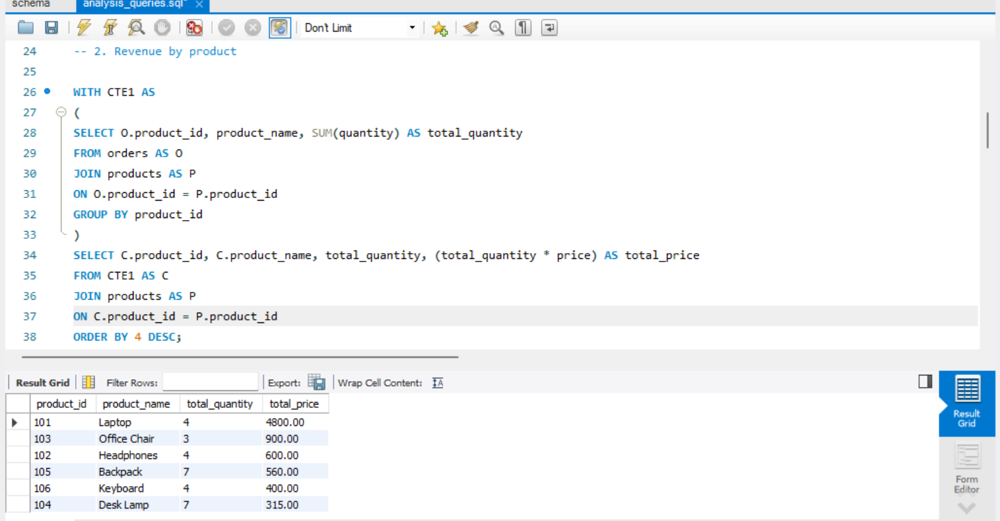
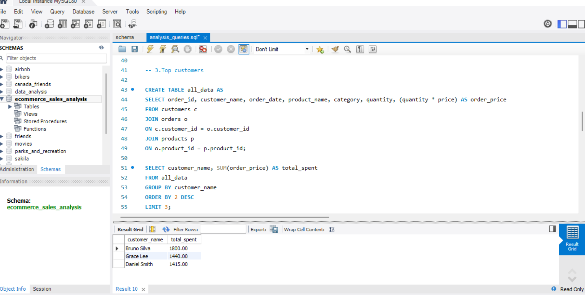
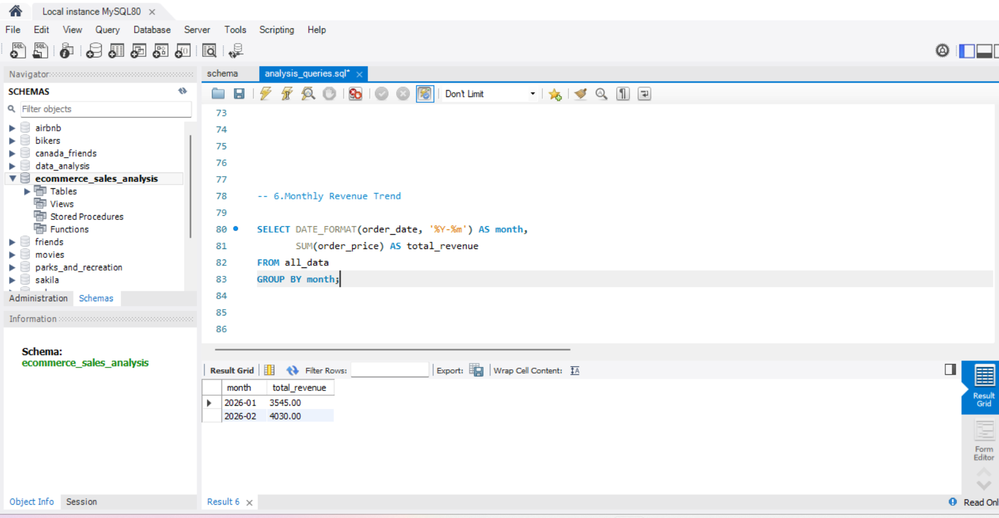

# SQL E-commerce Sales Analysis

## Project Overview

This project analyzes e-commerce sales data using MySQL to answer common business questions related to revenue, customers, product performance, and sales trends.

The goal is to demonstrate SQL skills through a realistic business scenario using relational tables, joins, aggregations, common table expressions (CTEs), and grouped analysis.

---

## Tools Used

- MySQL
- SQL
- MySQL Workbench

---

## Database Structure

The project is built using three relational tables:

- **customers** → customer information
- **products** → product details and prices
- **orders** → transaction records linking customers and products

These tables are connected using primary keys and foreign keys.

---

## Business Questions Answered

This analysis answers the following questions:

1. What is the total revenue generated by all orders?
2. Which products generate the most revenue?
3. Which customers spent the most money?
4. Which product category performs best?
5. Which cities generate the most sales?
6. How does revenue change by month?
7. Which products sell the most units?
8. Which customers placed multiple orders?
9. What is the average order value?

---

## Key Insights

Some key insights from the analysis include:

- **Total revenue** reached **$7,575.00**
- **Laptop** was the top product by revenue, generating **$4,800.00**
- **Bruno Silva** was the top customer, spending **$1,800.00**
- **Electronics** was the highest-performing category with **$5,800.00** in sales
- **Vancouver** generated the most revenue among all cities
- Revenue increased from **January 2026** to **February 2026**

---

## Example Analysis

### Revenue by Product



### Top Customers



### Monthly Revenue



---

## Files in This Repository

```text
sql-ecommerce-sales-analysis/
│
├── schema.sql
├── data_inserts.sql
├── analysis_queries.sql
└── README.md
```
---

## Author

**Rayan Serratine**

Data Analytics Portfolio  
Vancouver, Canada
